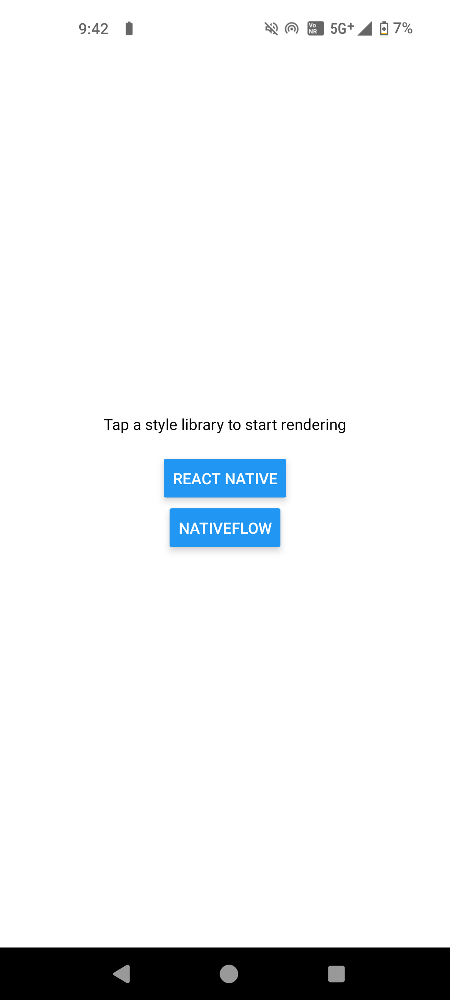

# React Native & NativeFlow Benchmark

Original reproducer was created by @tj-mc: <https://github.com/tj-mc/styled-components-native-perf-reproducer>

This is an Expo SDK 51 App reproducer to demonstrate the performance difference between vanilla React Native styles and NativeFlow

Tests include React Native [StyleSheet](https://reactnative.dev/docs/stylesheet) & [NativeFlow](https://nativeflow.js.org)

Feel free to fork or PR this repo with improvements or to include other styling libraries.

***Note: Test scores may vary between different machines with different hardware***

1000 items are rendered in `Array.map` and it's a **basic** test in DEV mode. When more features of each library are added (eg. media queries etc) as your project grows the measurements may vary by a lot.

Read this comment on how to test the performance: <https://github.com/styled-components/styled-components/issues/3940#issuecomment-1630244738>

## Results - Rendering Time for 1000 Empty Views (ms) in DEV mode

Device: Nothing 1 (8 GB, 128 Storage) - Android 14 [Expo Go]

<video controls>
  <source src="assets/readme/video.mp4" type="video/mp4">
  Your browser does not support the video tag.
</video>

|   Library   | 1   | 2   | 3   | 4   | 5   | 6   | Avg    | % Slowdown |
|-------------|-----|-----|-----|-----|-----|-----|--------|------------|
| Native      | 289 | 324 | 326 | 333 | 339 | 337 | 324.67 | 0          |
| NativeFlow  | 333 | 351 | 344 | 364 | 355 | 357 | 350.67 | 8.01%      |

## Reproduction Steps

1. Start the profiler by pressing Shift + M and open React Dev Tools.
2. Open profiler and hit record
3. Press the toggle button and stop recording
4. Record the time to render App.ts
5. Average the result across at least 3 runs
